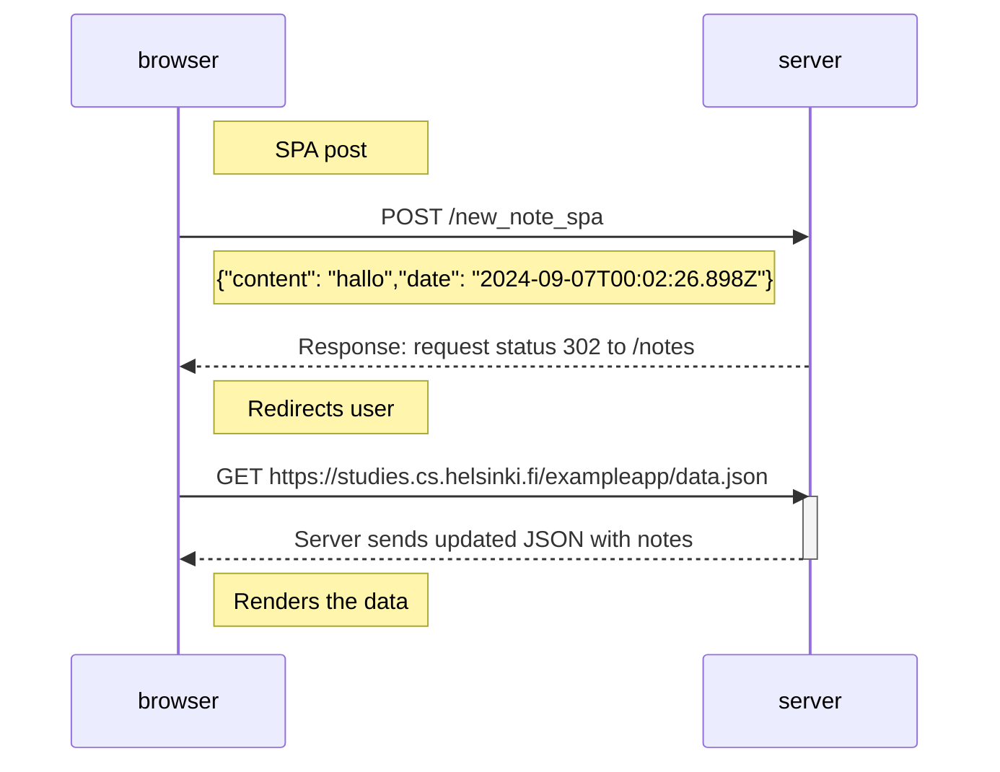

```mermaid

sequenceDiagram
    Note right of browser: SPA post

    browser->>server: POST /new_note_spa
    Note right of browser: {"content": "hallo","date": "2024-09-07T00:02:26.898Z"}
    server-->>browser: Response: request status 302 to /notes
    Note right of browser: Redirects user
    browser->>server: GET https://studies.cs.helsinki.fi/exampleapp/data.json
    activate server
    server-->>browser: Server sends updated JSON with notes
    deactivate server
    Note right of browser: Renders the data
```
